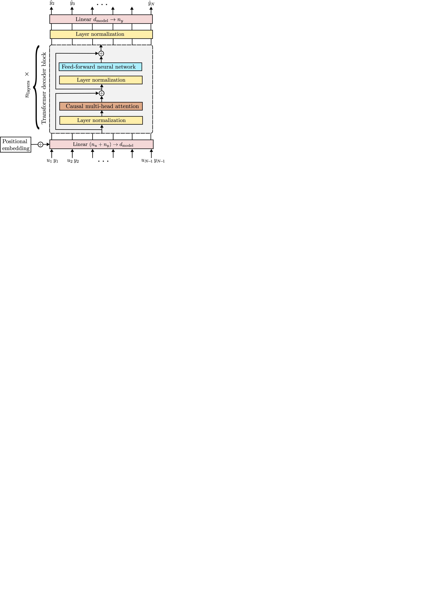
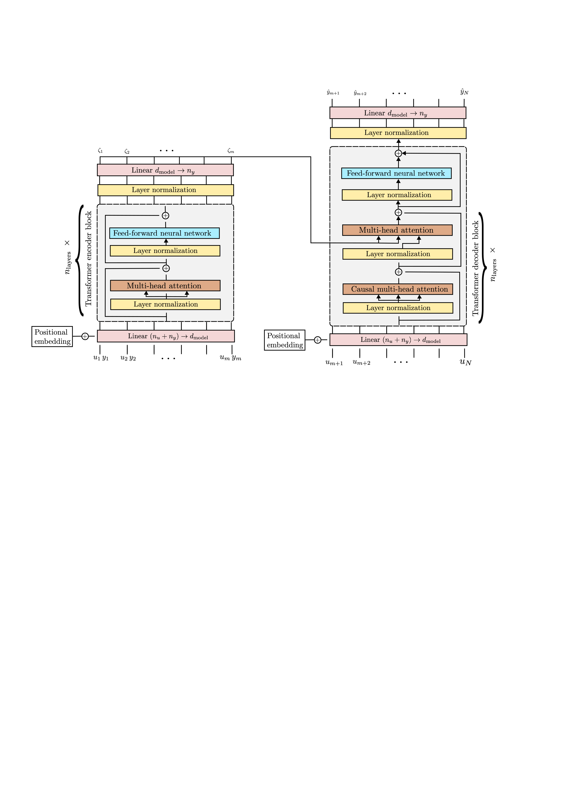

# dynoGPT: model-free meta learning of dynamical systems with Transformers

This repository contains the Python code to reproduce the results of the paper dynoGPT: model-free meta learning of dynamical systems with Transformers (in preparation, 2023)
by Marco Forgione, Filippo Pura and Dario Piga.


We introduce the concept of model-free meta learning for System Identification, where a *generalized* model is able to describe an entire class of dynamical systems,
instead of a single instance. The generalized model is able to understand the underlying dynamics from a context of provided input/output samples and to 
perform a task such as one-step-ahead prediction or multi-step-ahead simulation, that would otherwise require a model trained on each particular datasets.


## One-step-ahead model-free prediction

Decoder-only (GPT-like) Transformer architecture for model-free one-step-ahead prediction: 

<!--  -->


## Multi-step-ahead model-free simulation

Encoder-decoder (machine-translation-like) Transformer architecture for model-free multi-step-ahead simulation:

<!--  -->


# Software requirements:
Experiments were performed on a Python 3.11 conda environment with

 * numpy
 * scipy
 * matplotlib
 * pytorch (>= 2.0)
 
These dependencies may be installed through the commands:

```
conda install numpy scipy pandas matplotlib
conda install pytorch -c pytorch
```

To run the software, please make sure that this repository's root folder is added to 
your PYTHONPATH.

# Citing

If you find this project useful, we encourage you to:

* Star this repository :star: 

* Cite the [paper](https://arxiv.org/abs/2206.12928) 
```
@article{forgione2023a,
  title={dynoGPT: model-free meta learning of dynamical systems with Transformers?},
  author={Forgione, M. and Pura, F. and Piga, D.},
  journal={arXiv preprint arXiv:2206.12928},
  year={2022}
}
```
