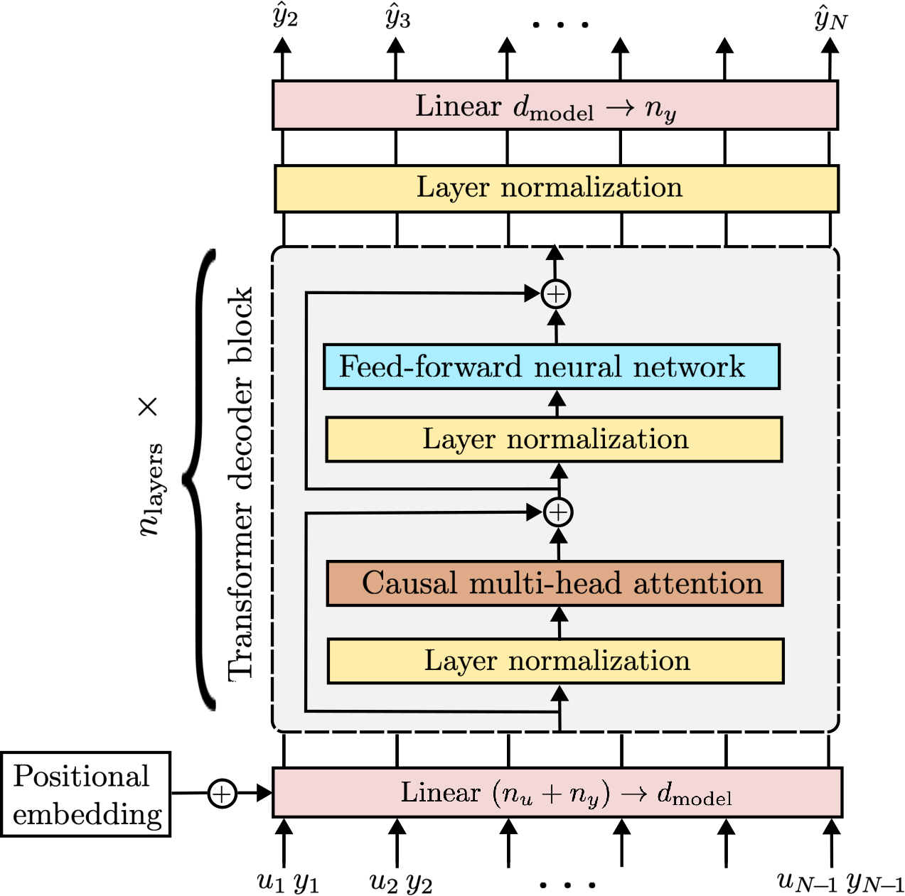
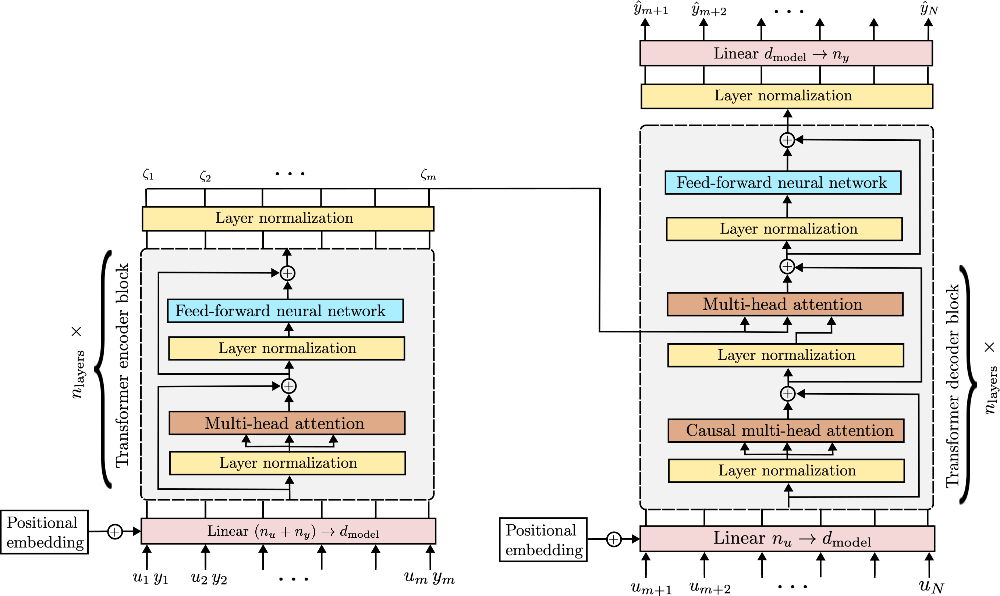

# In-context learning for model-free system identification

This repository contains the Python code to reproduce the results of the paper [In-context learning for model-free system identification](http://arxiv.org/abs/2308.13380)
by Marco Forgione, Filippo Pura and Dario Piga.


We introduce the concept of model-free in-context learning for System Identification, where a *meta model* is trained to describe an entire class of dynamical systems,
instead of a single instance. The meta model is able to understand the underlying dynamics from a context of provided input/output samples and to 
perform a task such as one-step-ahead prediction or multi-step-ahead simulation, that would otherwise require a model trained on each particular dataset.


## One-step-ahead model-free prediction

Decoder-only (GPT-like) Transformer architecture for model-free one-step-ahead prediction: 

<!--  -->


## Multi-step-ahead model-free simulation

Encoder-decoder (machine-translation-like) Transformer architecture for model-free multi-step-ahead simulation:

<!--  -->


# Main files

The training scripts are:

* [train_onestep_lin.py](train_onestep_lin.py): Decoder-only Transformer for one-step-ahead prediction on the LTI system class 
* [train_onestep_wh.py](train_onestep_wh.py): Decoder-only Transformer for one-step-ahead prediction on the WH system class 
* [train_sim_lin.py](train_sim_lin.py): Encoder-decoder Transformer for multi-step-ahead simulation on the LTI system class 
* [train_sim_wh.py](train_sim_wh.py): Encoder-decoder Transformer for multi-step-ahead simulation on the WH system class 

The scripts above except ``train_onestep_lin.py`` accept command-line arguments to customize the architecture and aspects of the training. 
For instance, the large one-step-ahead Transformer for the WH class described in the paper may be trained with the command:

```
python train_onestep_wh.py --out-file ckpt_onestep_wh_large --seq-len 1024  --n-layer 12 --n-head 12 --n-embd 768 --batch-size 20
```

Trained weights of all the Transformers discussed in the example section of the paper are available as assets in the [v0.3 Release](https://github.com/forgi86/sysid-transformers/releases/tag/v0.3).

Jupyter notebooks that load the trained model and make predictions/simulations on new data are also available in the repo, e.g. [test_onestep_lin.ipynb](test_onestep_lin.ipynb) for one-step prediction on the LTI class.

# Software requirements
Experiments were performed on a Python 3.11 conda environment with:

 * numpy
 * scipy
 * matplotlib
 * python-control
 * pytorch (v2.1.0)
 * pytorch-ident
 
These dependencies may be installed through the commands:

```
conda install numpy scipy matplotlib
conda install -c conda-forge control slycot
conda install pytorch -c pytorch
```

For more details on pytorch installation options (e.g. support for CUDA acceleration), please refer to the official [installation instructions](https://pytorch.org/get-started/locally/).

The following packages are also useful:

```
conda install jupyter # (optional, to run the test jupyter notebooks)
pip install wandb # (optional, for experiment logging & monitoring)
pip install pytorch-ident # (optional, for the comparisons with non-linear least squares on the WH model class)
```

# Hardware requirements
While all the scripts can run on CPU, execution may be frustratingly slow. For faster training, a GPU is highly recommended.
To run the paper's examples, we used a server equipped with an nVidia RTX 3090 GPU.


# Citing

If you find this project useful, we encourage you to:

* Star this repository :star: 


* Cite the [paper](https://arxiv.org/abs/2308.13380) 
```
@article{forgione2023from,
  author={Forgione, Marco and Pura, Filippo and Piga, Dario},
  journal={IEEE Control Systems Letters}, 
  title={From System Models to Class Models:
   An In-Context Learning Paradigm}, 
  year={2023},
  volume={7},
  number={},
  pages={3513-3518},
  doi={10.1109/LCSYS.2023.3335036}
}
```
